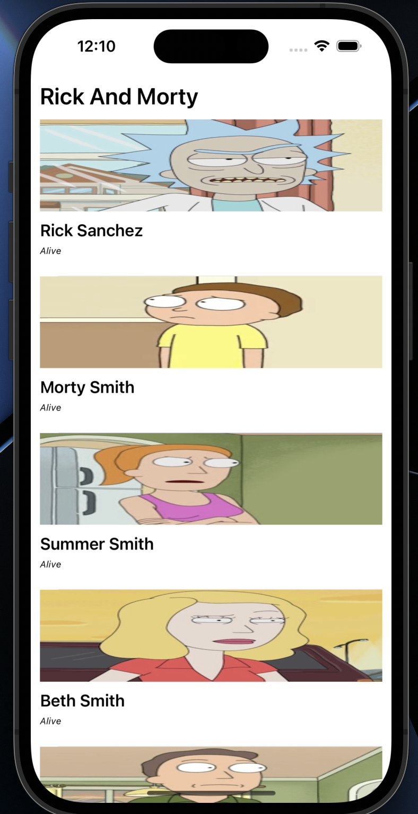

# Rick and Morty App

<p align="center">
  
</p>

A simple iOS application that fetches and displays characters from the Rick and Morty TV show. The app is built using Swift and utilizes the SnapKit library for layout.

## Features

- Fetches character data from the Rick and Morty API.
- Displays character information in a table view.
- Uses Alamofire for network requests.
- Implements the MVVM architectural pattern.
- Utilizes SnapKit for easy and flexible Auto Layout.

## Prerequisites

Before running the application, ensure that the following software is installed:

- Xcode: Make sure you have Xcode installed on your machine.
- iOS Development Environment: This application is built using Swift and requires an iOS development environment.

## Installation

1. Clone the repository:

```
git clone https://github.com/Okariuss/Swift-RickAndMorty.git
```

2. Open the project in Xcode:

```
cd RickAndMortyApp
open RickAndMortyApp.xcodeproj
```

3. Build and run the project using the Xcode simulator or by connecting a physical device.

## Usage

1. Launch the application on your iOS device or simulator.
2. The app will fetch character data from the Rick and Morty API and display it in a table view.
3. Scroll through the characters to see their names, statuses, and images.

## Dependencies

This project uses the following dependencies, which are managed using CocoaPods:

- Alamofire: A Swift-based HTTP networking library for making API requests.
- SnapKit: A Swift autolayout DSL for building constraint-based layouts.

## License

This project is licensed under the MIT License. See the [LICENSE](LICENSE) file for more information.
